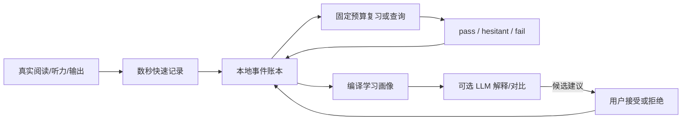
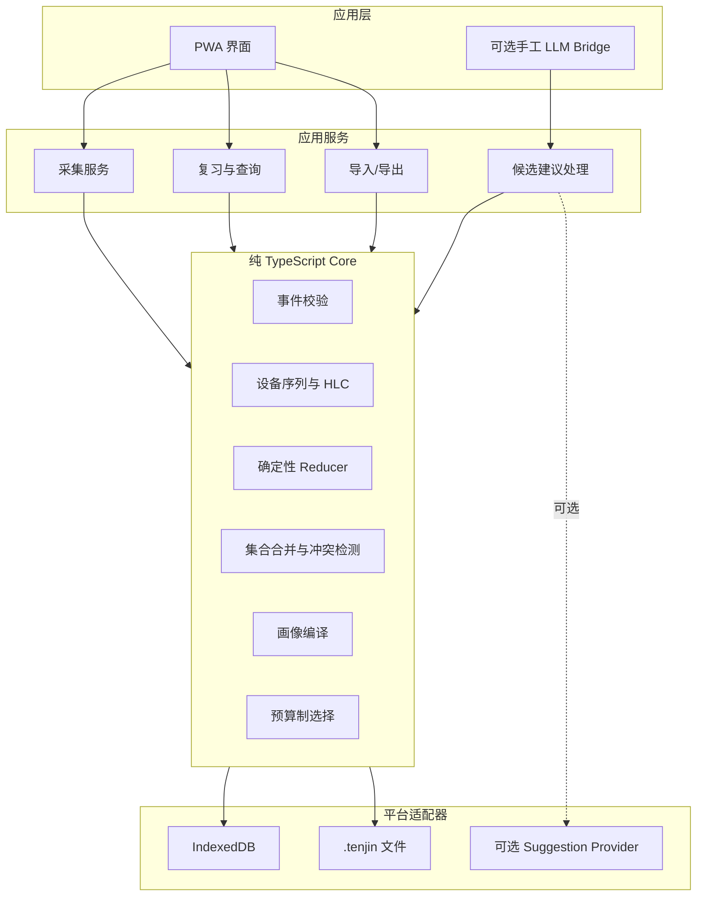

# Tenjin：本地优先的个人日语学习账本（设计定稿 / 待交叉审核）

> **文档状态**：架构与规则设计已完成三轮评审，等待 Fable 5 交叉审核；尚未开始实现。
>
> **日期**：2026-07-10
>
> **目标读者**：接手开发者、独立架构 reviewer、学习产品 reviewer。
>
> **本轮关键变化**：原方案从“桌面 Python CLI + 可选 agent”调整为“PWA-first、Capacitor-ready、无 LLM 也能运行绝大部分功能”的本地优先应用。

---

## 0. 需求摘要与设计意图

Tenjin 服务一名中高级到高级的日语学习者。学习者已有完整基础语法和较强阅读能力，目标不是继续堆知识点，而是解决真实环境中的稳定理解、自然表达和调用自动化问题。

主要痛点：

1. 查过、听漏、被纠正的高价值学习证据散落在不同工具中，没有闭环。
2. 同一内容可能“会读不会听”“听懂但不会用”，普通词表无法表示通道差异。
3. 输出通常语法正确，但存在直译腔、书面化、语域错配和调用慢。
4. AI 每次像第一次见到学习者，重复解释已掌握内容。
5. 现有方案容易要求大量录入、整理和复习欠账，最终被弃用。

用户重申的核心意图：

- 工具必须轻，日常使用不能形成明显负担。
- 工具必须真正针对个人学习证据，而不是普通聊天机器人或通用背词 App。
- iPhone 离开电脑后，仍能独立记录、查询和复习。
- 不要求实时同步；允许通过文件定期交换。
- 不绑定任何 LLM、厂商 API 或 agent 平台。
- 没有 LLM 时，绝大多数功能仍应完整运行。

硬约束：隐私优先、本地数据所有权、可导出、无平台锁定、最少维护、不制造欠账、从真实材料中学习、结论可解释。

---

## 1. 最终方向与范围判断

### 1.1 一句话定义

Tenjin 是一个**离线可用、以学习事件为事实源的个人日语学习账本 PWA**：它把手机和电脑上产生的失败、验证、纠正与提问记录为可合并事件，再用确定性规则生成学习状态、复习选择和可选的 AI 上下文。

### 1.2 已拍板方向

| 维度 | 决策 | 原因 |
|---|---|---|
| 产品形态 | TypeScript 本地优先 PWA | 同一实现覆盖 iPhone 与电脑，支持离线和主屏安装 |
| 原生升级 | Capacitor-ready，不立即封装 | 保留原生文件/存储/分享能力的逃生舱，不提前承担 App Store 成本 |
| 数据模型 | 追加事件唯一事实源，视图全部可重建 | 支持审计、纠正、多设备合并和规则升级 |
| 多设备 | 无主端、手动 `.tenjin` 文件交换 | 不建服务器，不制造账号与同步维护面 |
| LLM | 可拔插增强器 | 无 LLM 时仍可记录、查询、复习、统计和导入导出 |
| 复习 | 固定预算、无可见 due 欠账 | 长中断后可以照常使用，不把工具变成义务 |
| 听力归因 | 认识状态 + hesitation，不做细分类器 | 观测不足时不制造伪精度 |
| 掌握语义 | `suppressed` 代替“永久退休” | 只抑制主动重复解释，不宣称永久掌握 |

### 1.3 明确不做

MVP-A 不做：

- 后台实时同步、账号系统、多人协作、通用 CRDT；
- Web 仪表盘、复杂统计中心、签到、红点、连续学习奖励；
- 音频录制、ASR、Anki/FSRS 集成、毫秒反应时；
- 自动细粒度听力归因、自然度评分、错误模式自动升格；
- 向量记忆库、厂商专属 LLM SDK、云端长期记忆；
- iOS 原生壳、CloudKit、WebDAV 或 S3 适配器；
- 固定 200–300 条目的硬上限。

这些能力只有在前序数据证明存在真实问题时才进入下一阶段。

---

## 2. 核心体验与成功标准

### 2.1 日常闭环



### 2.2 用户应持续感受到的回报

- 查过、听漏和被纠正的内容不再蒸发。
- 查询某个词或表达时，可以看到自己在哪个通道失败过、验证过什么。
- 复习只拿当前时间预算内最值得看的内容，不显示欠账。
- 已稳定内容不再被系统主动重复解释。
- 换 LLM、停用 LLM或换设备，不会失去个人学习状态。
- 手机负责快记，电脑可以负责慢整理；两端通过事件包收敛。

### 2.3 失败判定

以下任一情况成立，说明当前方案需要收缩或改路，而不是继续加功能：

- 移动端常用文本采集 P50 超过 5 秒或 P90 超过 8 秒；
- 第 2、3 周采集量明显衰减，且用户自报原因是操作麻烦；
- 数据丢失、重复导入造成重复证据或不同设备无法收敛；
- 无 LLM 模式不能完成核心闭环；
- 复习界面重新制造 due、欠账或回归压力；
- 用户无法解释某条状态为何升级、降级或被抑制。

---

## 3. 总体架构



架构硬边界：

- `core` 不依赖浏览器、DOM、IndexedDB、React、网络或 LLM。
- 核心包必须能在 Node 环境运行全部测试。
- PWA、存储、文件和 LLM 都是适配器，不拥有业务真相。
- LLM 只能创建 proposal，不能直接创建状态结论。
- 状态、画像、统计和候选列表全部是事件集合的派生视图。
- 浏览器数据库是工作副本，不是唯一备份。

建议工程结构：

```text
apps/
  web/                  PWA 界面与 Service Worker
packages/
  core/                 事件、HLC、reducer、查询、调度
  storage-indexeddb/    IndexedDB 事务适配器
  exchange/             .tenjin 包校验与导入导出
  llm-contract/         可选 Suggestion Provider 契约
tests/
  fixtures/             跨设备、乱序、redaction 测试数据
```

建议技术栈：TypeScript、React、Vite、Vitest、fast-check、Playwright。IndexedDB 可使用轻量封装，但任何库类型不得泄漏到 `core`。

---

## 4. 数据所有权与隐私边界

### 4.1 三类数据

| 数据 | 地位 | 示例 |
|---|---|---|
| 事件账本 | 唯一事实源 | capture、失败、验证、纠正、合并、撤销 |
| 派生视图 | 可丢、可重建 | item 状态、查询索引、画像、统计、候选列表 |
| Context | 独立原文层 | 原句、近似音、纠正句对，未来可能有音频 |

事件只保留 `context_hash` 和必要的抽象学习字段。原句、人物、场合、URL 和媒体不进入状态字段。

### 4.2 Context 缺失

默认导出不带 contexts，因此另一设备出现悬空 `context_hash` 是正常情况：

- UI 显示“原文保留在另一设备”；
- reducer、查询、状态和导入不报错；
- 需要原文时由用户选择带 context 的导出包；
- context 永远不是能力状态重建的硬依赖。

### 4.3 隐私级删除

Append-only 是常规纪律，不高于隐私删除权。执行 redaction 时：

1. 用无内容墓碑替换敏感事件体；
2. 保留目标 `event_id` 和内容哈希，防止旧包复活；
3. 删除关联 context；
4. 增加 ledger generation；
5. 用当前 reducer 全量重算；
6. 提醒用户分别清理其他设备和旧导出文件。

普通撤销不调用 redaction。只有隐私内容已经进入正式事件字段时，才使用该例外流程。

---

## 5. 多设备收敛与 `.tenjin` 交换协议

### 5.1 收敛模型

```text
本地事实 = 按 event_id 去重的有效事件集合
导入      = 本地集合 ∪ 导入集合
视图      = 对有效事件按规范规则执行确定性 fold
```

导入必须满足交换律、结合律和幂等性。相同事件集合无论按什么文件顺序导入，最终派生状态必须一致。

### 5.2 设备身份与时间

每次安装生成新的 `device_id`。清空存储、删除主屏应用或重新安装后生成新 incarnation，永不复用旧身份。

```text
event_id       = device_id:seq
seq            = 本设备严格递增整数
occurred_at    = 学习行为发生的 UTC 时间
recorded_at    = 事件写入的 UTC 时间
hlc            = 轻量混合逻辑时钟
规范排序键      = (hlc, device_id, seq)
```

时间规则：

- 学习间隔、30 天窗口和复发窗口一律按 `occurred_at` 计算；
- HLC 只解决账本因果与稳定排序，不代表学习时间；
- `occurred_at` 可以早于 `recorded_at`，支持事后补录；
- `occurred_at` 不允许晚于 `recorded_at`；用户填写未来时间时拒绝或回落为 `recorded_at`；
- 导入后，本机 HLC 基线提升到已见最大值；
- 历史 incarnation 的水位永久保留，不因设备不再使用而删除。

### 5.3 导出包

`.tenjin` 是带版本号的压缩包：

```text
manifest.json       schema、generation、导出设备、各 device 最大 seq
events.jsonl        当前持有的抽象事件
redactions.jsonl    无内容墓碑
contexts/           默认不包含，用户显式选择才加入
```

MVP 使用完整包，不做增量包和共享目录分段。数万事件仍只占少量空间；在真实性能问题出现前不购买复杂度。

### 5.4 导入事务

1. 完整解析到临时区；
2. 校验 schema、event_id、seq、时间和引用格式；
3. 按 `event_id` 去重取并集；
4. redaction 墓碑优先，旧包不能复活内容；
5. 找不到目标的 supersede/merge 进入隔离区；
6. 扫描相同 `identity_key`、不同 `item_id` 的 merge 候选；
7. 检测 capture 双重 promote 和语义冲突；
8. 用当前 reducer 全量重算；
9. 全部成功后原子替换当前工作副本。

导入中途被系统杀掉时，旧工作副本保持不变。重复导入同一包不产生重复证据。

### 5.5 副本水位

Manifest 携带导出设备已见的 `{device_id: max_seq}`。导入对方包后，本机可计算：

- 对方已持有本机截至哪个 seq；
- 本机有多少事件尚未被任何已知外部副本覆盖；
- 上次生成包和上次吸收外部包的时间。

水位是交换协议元数据，不写入学习事件。设置页显示它；日常首页最多出现一个可关闭的“尚无外部副本”提示。

### 5.6 Item 身份与别名

- `item_id` 使用随机稳定 UUID，写入后永不修改；
- `identity_key` 由版本化规范化规则生成，只用于发现可能重复；
- 相同 lemma、读音和词性仍可能是不同义项或 usage facet，不自动合并；
- `items_merged` 建立别名等价类，查询期解析代表元；
- `event_reassigned` 用于少量拆分和人工改派；
- 错误重复比错误合并更容易修复，因此默认保守。

### 5.7 并发 Promote 同一 Capture

两个设备可能分别整理同一 capture。处理规则：

1. 每个 `capture_promoted` 必须带 `capture_id`、`promotion_id` 和派生观察引用；
2. 按规范序最早的 promotion 暂时生效；
3. 后续 promotion 的派生观察默认不计入能力证据；
4. Promotion fingerprint 由 `capture_id + channel + 规范 item_id 集合 + 观察 kind + result` 生成，不包含 context 原文；
5. 若 promotion fingerprint 相同，视为重复整理并静默折叠；
6. 若通道、item 或观察语义不同，capture 进入 conflict inbox；
7. 用户可选择第一份、第二份或明确保留两份；
8. 解决前继续记录新事件，但冻结相关状态晋升。

---

## 6. iOS 与桌面采集流程

### 6.1 Capture 是一等事件

`capture_created` 进入正式事件流并参与 `.tenjin` 交换。整理动作也是事件：

- `capture_promoted`
- `capture_ignored`
- `capture_discarded`

因此“手机快记、电脑慢整理”是正式预期用法，而不是偶然能力。

### 6.2 移动端主路径

```text
在原应用复制内容
→ 打开主屏 Tenjin
→ 点击“粘贴记录”
→ 选择：查过 / 没听出 / 表达纠正
→ 自动保存
```

设计目标：

| 场景 | 目标 |
|---|---|
| 已复制文本 | P50 ≤5 秒，P90 ≤8 秒 |
| 手工输入短词 | 不含打字时间 ≤5 秒 |
| 表达纠正句对 | ≤15 秒，不纳入高频红线 |

采集最多作一个分类选择，不要求填写读音、原因、难度和标签。

### 6.3 三种采集结果

**查过 / 没看懂**

- 最小输入是所选词或短语；
- 可选上下文句；
- 查词只证明出现过学习摩擦，默认进入 `unstable`，不武断判为完全 unknown；
- 无法安全确认 item 时只保留 capture。

**没听出**

- 字幕、转录、近似假名、罗马字或用户自创音形都是合法最小输入；
- iOS 视频无法复制字幕时允许只记近似音；
- 桌面端事后对照字幕补录是正式兄弟路径；
- 归因延后到复习，只问“立刻认识 / 认识但慢 / 不认识”。

**表达 / 被纠正**

- 可只记原句、只记纠正版或记录句对；
- 只有完整句对才能进入表达对比复习；
- 不完整内容停留在 capture 层；
- 系统不脑补语域、自然度或错误原因。

### 6.4 撤销

保存后显示 8 秒撤销 toast：

- 立即写入 `capture_created`；
- 撤销时追加 `capture_discarded`；
- 删除尚未被其他事件引用的 context；
- 不调用 redaction；
- 跨设备导入时 discarded capture 不会复活为待整理项。

### 6.5 Shortcut 候选

Shortcut 不是 MVP 硬依赖。候选流程为：分享所选文本 → Shortcut 封装临时 payload → 尝试打开 capture URL。

- Payload 使用 fragment，避免发送给静态服务器；
- 页面接收后立即用 `history.replaceState` 清理 URL；
- fragment 仍可能短暂进入历史或系统界面，不视为隐私保险箱；
- 如果 URL 落入 Safari 而非主屏容器，不得写入正式账本；
- 失败时只保留剪贴板 payload，并明确提示“尚未记录”。

只有同时通过下列真机门槛才保留：

- 连续 10 次零丢失；
- P50 ≤5 秒、P90 ≤8 秒；
- 不出现文件选择器；
- 不写入错误存储容器；
- 失败状态清晰。

否则删除 Shortcut 路径，保留应用内复制粘贴。

---

## 7. 事件模型

### 7.1 公共信封

```yaml
schema_version:
event_id:
device_id:
seq:
hlc:
occurred_at:
recorded_at:
actor: user | deterministic_rule | llm_proposal
kind:
rule_version:
item_id:
capture_id:
context_hash:
refs:
payload:
```

`rule_version` 仅用于审计。状态始终由当前规则对全部有效事件重算，禁止“老事件用老规则、新事件用新规则”的混合模型。

### 7.2 事件族

**采集**

- `capture_created`
- `capture_discarded`
- `capture_promoted`
- `capture_ignored`

**Item**

- `item_created`
- `item_target_changed`
- `items_merged`
- `event_reassigned`
- `item_dropped`
- `item_reactivated`

**学习观察**

- `lookup_observed`
- `encounter_observed`
- `listening_miss_observed`
- `production_correction_observed`
- `verification_observed`
- `explicit_question_observed`
- `wild_failure_observed`

`encounter_observed` 只提供曝光分母，绝不作为 pass。相同 item 在同一 material/session 内默认只记一次 encounter，避免长文本重复计数。

MVP-A 先定义并支持该事件的导入与 reducer 语义，但在没有“阅读材料扫描”入口前不自动生成 encounter。任何依赖曝光分母的趋势指标，只有对应 emitter 上线并通过 session 去重测试后才启用，不能拿缺失分母的数据作早期成功结论。

**候选与纠正**

- `proposal_created`
- `proposal_accepted`
- `proposal_rejected`
- `event_superseded`
- `conflict_resolved`

LLM 只能产生 proposal。未接受 proposal 不进入状态和调度。

---

## 8. 学习者模型与状态机

### 8.1 三通道

- R：阅读识别；
- L：听力识别；
- P：产出调用。

通道状态独立，同一 item 可以 R stable、L unstable、P untracked。

### 8.2 通道状态

| 状态 | 含义 |
|---|---|
| `untracked` | 当前不是目标通道 |
| `unknown` | 用户明确表示不认识 |
| `unstable` | 有部分认识证据，但仍失败、犹豫或被纠正 |
| `stable` | 完成间隔验证，进入静默观察与低频抽查 |
| `suppressed` | 默认不主动讲解、不进入普通复习，但不宣称永久掌握 |

`conflicted` 是覆盖层，不是能力状态。

### 8.3 时间与验证规则

- 所有学习窗口按 `occurred_at` 计算；
- 同一天多次 pass 只计一次；
- 三次有效 pass 至少跨越 7 天；
- 当场失败后立即重测通过只记 re-encounter，不记 pass；
- `hesitant` 不晋升、不清零；
- TTS 不能成为 L stable 的唯一证据；
- 没有曝光时，“30 天没失败”不构成掌握证据。

### 8.4 转换规则

| 当前状态 | 事件 | 结果 |
|---|---|---|
| `untracked` | 新增目标通道 | `unstable` |
| 任意 | 用户明确不认识 | `unknown` |
| `unknown/unstable` | 合格 pass | 有效验证 +1 |
| `unknown/unstable` | hesitant | 保持状态，不晋升 |
| `unknown/unstable` | fail | `unstable`，验证计数清零 |
| `unknown/unstable` | 满足三次间隔验证 | `stable` |
| `stable` | 单次 fail | 保持 stable，增加 `at_risk` |
| `stable` | 30 天内第二次 fail | `unstable` |
| `stable` | 30 天后再次无犹豫通过 | `suppressed(reason=verified)` |
| `stable` | 因预算停止主动调度 | `suppressed(reason=budget)` |
| `suppressed` | 任意真实失败 | `unstable`，复发次数 +1 |
| `dropped` | 新明确失败 | 重新激活为 `unstable` |

### 8.5 讲解梯度

- `unknown/unstable`：允许主动展示已有解释、历史笔记或可选 LLM 解释；
- `stable`：默认静默观察，不主动解释；每次会话最多选择一个稳定条目作可选低频验证；
- `suppressed`：完全静默，不进入普通复习；
- 显式提问始终绕过 stable/suppressed；
- 新义项、新语域、新搭配使用独立 item 或 usage facet。

仅出现 `encounter_observed` 不算验证。用户对低频探测明确回答 pass/hesitant/fail 后才产生验证证据。

### 8.6 Item 总体状态

- 任一目标通道仍为 unknown/unstable/stable：item 为 active；
- 所有目标通道均 suppressed：item 为 suppressed；
- 用户执行价值止损：item 为 dropped；
- 存在未解决语义冲突：叠加 conflicted。

冲突期间继续记录事件，只冻结受影响状态的晋升；不显示催办红点。

---

## 9. 固定预算复习与查询

### 9.1 无 due 语义

用户选择“看 5 条”“看 10 条”或一个时间预算，系统返回预算内的候选。没有到期总数、欠账、连续天数和逾期惩罚。

长中断后回来：

- 不显示积压；
- 直接给当前预算内最值得看的内容；
- 低价值旧项自然降权；
- 所有历史仍可搜索。

### 9.2 确定性优先级

MVP 不使用不可解释的综合概率分数。候选按层级选择：

1. 近期真实失败、复发和用户明确想处理的 item；
2. R/L 通道缺口或刚发生的 production correction；
3. 已满足下一次间隔条件的 unstable item；
4. stable 的低频验证候选；
5. 仍有预算时才回看低证据 item。

同层级按 `last_verified` 最旧、失败次数、规范 item_id 排序。所有选择理由可以在“为什么出现”中查看。

### 9.3 Reviewable 条件

| 通道 | 无 LLM 可复习条件 |
|---|---|
| R | item + 用户笔记、上下文或可揭示答案 |
| L | MVP-A 只做文字识别归因，真正音频训练后置 |
| P | 有原句/纠正版句对，或用户提供调用提示 |

缺少答案或材料的 capture 仍可查询，但不强塞进复习。

### 9.4 条目上限

MVP-A 不实现 200–300 的拍脑袋硬上限。先测真实复习吞吐：

- 如果固定预算始终能选出高价值内容，不需要 admission control；
- 如果低价值 item 明显挤压复习，再引入基于预算的候选池；
- captures 永远可记录，候选池控制不能反向阻断采集。

---

## 10. 无 LLM 降级与可选 LLM 接口

### 10.1 无 LLM 完整可用功能

- 快速采集、整理、撤销；
- item 创建、合并、拆分和搜索；
- 状态重算、证据时间线和解释；
- 固定预算复习；
- profile 编译；
- `.tenjin` 导入导出、副本水位和 redaction；
- 基础统计与 proposal 接受/拒绝记录。

### 10.2 无 LLM 时的 read/coach

- Read：确定性 item join、状态过滤、历史笔记、显式提问记录；不生成语义解释。
- Coach：记录原句和纠正版、搜索相似已确认模式；不裁判自然度。
- 用户可以把生成的 prompt 复制到任意外部模型，再把结构化结果粘回 Tenjin。

### 10.3 Suggestion Provider 契约

任何 LLM 适配器只实现统一契约：

```text
request:
  task
  current_context
  relevant_profile_excerpt
  related_confirmed_evidence
  output_schema

response:
  proposal_id
  suggestions[]
  evidence_refs[]
  uncertainty
```

规则：

- 适配器不得直接访问存储；
- 只接收当前任务所需的最小画像片段；
- 原文发送到远端前必须由用户显式触发；
- 返回值先校验 schema，再写 `proposal_created`；
- 用户接受或拒绝后才影响后续内容；
- 不内置任何厂商 API SDK作为 MVP 依赖。

MVP 的第一个适配器是手工 bridge，不保存 API key。

### 10.4 Profile 预算

`profile.md` 是小型热摘要，不是完整语块库：

- 目标预算 2–4KB；
- 保留已确认模式、top 瓶颈、R/L 缺口和显式指令；
- 个人语块库完整内容留在派生索引；
- 每次只按当前任务检索 top-N 相关语块；
- 裁剪优先级：显式指令与已确认模式 > 当前瓶颈 > 通道缺口 > 热语块 > 低证据旧项。

---

## 11. PWA 页面与反馈规则

MVP-A 只需要五个表面：

### 11.1 首页

- 主按钮：粘贴记录；
- 三个通道入口：查过、没听出、表达纠正；
- 次按钮：复习 5 条、搜索；
- 不显示连续天数、欠账、排行榜或复杂统计。

### 11.2 采集页

- 单输入为主；表达纠正允许句对；
- 最多一个分类选择；
- 保存后 8 秒撤销；
- 空内容不保存；
- context 写入失败时不创建假成功事件。

### 11.3 复习页

- 一屏一项；
- 揭示后选择 pass / hesitant / fail；
- 显示“为什么出现”；
- 不显示剩余欠账，只显示本次预算进度；
- 冲突 item 可查看，但不进行晋升型复习。

### 11.4 搜索与 Item 详情

- 显示 R/L/P 状态、证据数量和最近事件；
- 可以查看状态转换原因；
- 显式提问不受 suppression 限制；
- context 缺失时正常降级。

### 11.5 整理与数据设置

- 模糊 capture、merge 候选、语义冲突；
- 每次最多展示 5 条，可全部跳过；
- 导入、导出、副本水位、redaction；
- 设置页显示冲突和水位，不在首页催办。

### 11.6 iOS 安装

- iOS 首次写入前要求添加到主屏；
- 明确说明删除主屏图标会删除本机工作副本；
- 调用 `navigator.storage.persist()` 并展示实际持久化状态，但不把请求成功当作绝对保证；
- Safari 普通页面只用于安装引导和数据恢复，不作为可信长期写入容器。

平台依据：

- WebKit 存储策略：https://webkit.org/blog/14403/updates-to-storage-policy/
- 主屏 Web App 与 ITP：https://webkit.org/tracking-prevention/
- Web Share Target 尚未落地：https://bugs.webkit.org/show_bug.cgi?id=194593
- Clipboard 用户手势限制：https://webkit.org/blog/10855/async-clipboard-api/

---

## 12. MVP-A 范围与阶段门

### 12.1 MVP-A 的真实目标

MVP-A 不是验证“能否做出 PWA”，而是同时证明：

1. 数据协议在重复、乱序和跨设备情况下仍收敛；
2. 移动采集足够轻，第二、三周不明显衰减；
3. 无 LLM 也能完成记录、查询和复习闭环；
4. suppression 确实减少无效重复解释，而不误伤显式问题；
5. 用户愿意定期生成外部副本。

### 12.2 分阶段交付

**阶段 A0：Core 正确性**

- 事件 schema、HLC、引用校验；
- reducer 与状态机；
- 集合合并、冲突、redaction；
- 内存适配器和属性测试；
- 无 UI。

Gate：任意顺序导入、重复导入、旧包复活、双 promote 等测试全部通过。

**阶段 A1：单设备离线闭环**

- PWA 首页、采集、搜索、复习；
- IndexedDB 事务存储；
- Service Worker 离线启动；
- `.tenjin` 完整包导出和恢复；
- 无 LLM。

Gate：iPhone 主屏模式可离线完成 capture → item → review → export。

**阶段 A2：双设备交换与隐私**

- 水位 manifest；
- 手机快记、电脑整理、回传手机；
- context 缺失降级；
- merge/conflict inbox；
- redaction 与 generation。

Gate：两台设备任意顺序互导后状态一致，且隐私删除不被旧包复活。

**阶段 A3：摩擦验证与可选增强**

- 真实 iPhone 点击与耗时；
- Shortcut 候选试验；
- 手工 LLM bridge；
- 7–14 天个人使用验证。

Gate：采集和使用数据证明增强值得保留。未过门槛就删除增强，不扩功能。

### 12.3 下一阶段才考虑

- 音频 capture 与媒体包；
- 真正 L 通道音频先行训练；
- 自动静态托管之外的远端适配器；
- Capacitor 原生壳；
- 第三方 LLM API；
- Anki/FSRS 或其他调度桥接。

---

## 13. 测试契约

### 13.1 Core 单元与属性测试

- 每个事件类型的 schema 验证；
- `occurred_at <= recorded_at`；
- 每设备 seq 单调；
- HLC 导入提升；
- 状态转换全表；
- hesitation 不晋升；
- stable 两次失败降级；
- suppressed 真实失败复活；
- encounter 不等于 pass；
- 显式问题绕过 suppression；
- rule version 只作审计。

属性测试：

- 任意事件排列得到相同视图；
- `merge(A, A) = A`；
- `merge(A, B) = merge(B, A)`；
- `merge(merge(A, B), C) = merge(A, merge(B, C))`；
- 重复导入不增加证据；
- context 存在与否不改变能力状态。

### 13.2 多设备边界

- 两设备相同 capture 分别 promote；
- 相同 fingerprint 自动折叠；
- 不同 fingerprint 冲突并冻结晋升；
- supersede 先于目标到达；
- 历史 incarnation 仍参与水位；
- merge 后新增事件与拆分改派；
- 双向多轮导入最终收敛。

### 13.3 导入与隐私

- 导入同一包多次；
- 导入进行中模拟 App 被杀；
- 损坏 JSONL、未知 schema、重复 event_id 不同内容；
- redaction 后导入旧包；
- context 默认缺失；
- 带 context 包显式恢复；
- 导出包不意外携带原文。

### 13.4 工程边界

- `core` TypeScript 配置不包含 DOM lib；
- lint 禁止 `core` 导入 apps/adapters；
- Node 环境运行完整 core 测试；
- PWA 在离线模式启动；
- IndexedDB 写入失败不显示保存成功；
- Service Worker 升级不破坏现有账本。

### 13.5 真机手测

- iPhone 主屏安装与删除警告；
- 飞行模式启动、采集、查询、复习；
- 剪贴板粘贴系统提示；
- `.tenjin` 导入导出；
- Shortcut 是否落入正确主屏存储容器；
- 连续 10 次采集零丢失；
- P50/P90 点击耗时。

---

## 14. 指标与观察

### 14.1 采集与负担

- 文本采集 P50/P90；
- 第 2、3 周 capture 数衰减；
- capture → 学习事件的转化率；
- 周期回顾中自报“想记但嫌麻烦”的次数；
- 每周整理耗时。

不要求用户为“放弃记录”再执行一次实时打点。

### 14.2 学习闭环

- unstable → stable 转化；
- suppressed 复活率；
- 已确认模式的复发间隔；
- encounter 作为分母的失败密度；
- stable/suppressed 条目被系统主动重复解释的次数。

Encounter 密度指标在“阅读材料扫描”尚未进入实际使用前标记为 unavailable，不以零代替缺失数据。

### 14.3 AI 健康

若启用 LLM：

```text
proposal 拒绝率 = rejected / (accepted + rejected)
```

该指标衡量用户对建议的裁决，不声称是客观语言学准确率。模型重跑一致性只能衡量稳定性，不能代替正确性。

### 14.4 数据健康

- 未被外部副本覆盖的本机事件数；
- 导入失败和隔离事件数；
- identity merge 候选量；
- 未解决冲突量；
- redaction 旧包复活测试结果。

---

## 15. 风险与逃生条件

| 风险 | 失败机制 | 当前缓解 |
|---|---|---|
| PWA 数据丢失 | 浏览器清理、删主屏、存储压力 | 主屏硬要求、完整导出、水位、恢复测试 |
| 手动交换被遗忘 | 备份退化为“想起来再做” | 水位诚实显示，首页仅一次可关闭提示 |
| 多设备重复证据 | 双 promote、不同 item ID | promotion fingerprint、conflict、identity inbox |
| Capture 摩擦过高 | 复制、切应用、系统粘贴确认 | 5 秒门槛、Shortcut 仅试验、失败即删除 |
| 状态过度自信 | 把沉默或时间当掌握 | encounter 不计 pass、30 天需再次验证 |
| LLM 污染 | 建议直接进入状态 | proposal/accept/reject 闸门 |
| 隐私误写 | 敏感内容进入抽象事件 | context 分层、redaction 墓碑和 generation |
| 工具膨胀 | 为未来同步/音频/统计提前造平台 | 阶段门和明确不做清单 |

Capacitor 硬触发条件：

- 主屏 PWA 实测发生持久数据丢失；
- 核心移动采集无法稳定压到 5 秒门槛；
- 文件导入导出失败率影响实际使用；
- 后续媒体或分享能力被浏览器 API/配额阻断。

观察信号：如果手动交换长期不发生，并且真因文件动作而非用户不需要同步，可评估原生 iCloud 容器。它不是自动触发条件。

---

## 16. 推荐开发顺序

1. 建立 workspace 与纯 `core` 包边界。
2. 先写 reducer、merge、redaction 的失败测试，再写实现。
3. 完成内存事件仓和 `.tenjin` fixture。
4. 用属性测试证明集合收敛与顺序无关。
5. 实现 IndexedDB 事务适配器。
6. 做最小 PWA：采集、搜索、复习、导出。
7. 在真实 iPhone 主屏模式完成 A1 Gate。
8. 加双设备导入、水位、conflict 与 redaction UI。
9. 跑 7–14 天个人使用，记录摩擦和使用衰减。
10. 只有核心闭环成立后，试验 Shortcut 和手工 LLM bridge。

实现纪律：

- 生产代码必须先有失败测试；
- 每个阶段只实现当前 Gate 所需内容；
- 不因 UI 方便绕过事件层直接改状态；
- 不因模型输出“看起来合理”绕过 proposal 闸门；
- 不在未真机验证前声称 iOS 流程达标。

---

## 17. 交叉审核重点

请 Fable 5 优先挑战以下问题，不需要重新发明总体方向：

1. 事件集合并集 + HLC + 显式引用能否覆盖单人 2–3 设备的全部收敛边界？
2. 双 promote 的“首个暂时生效、语义分歧进冲突”是否仍有证据双计路径？
3. `occurred_at` 时间卫生规则是否足够应对事后补录和设备时钟错误？
4. 状态机是否仍有无法从事件确定推导的隐含状态？
5. encounter 分母是否会因材料/session 定义不稳而失真？
6. 无 LLM 的 R/P 复习是否足够有用，还是仍缺少最小答案来源？
7. PWA 主屏、剪贴板和手动文件交换是否会让“轻量”承诺失真？
8. Redaction 墓碑在多轮旧包导入后能否持续阻止敏感内容复活？
9. MVP-A 是否仍过大；若要再砍，应优先砍哪个非地基能力？
10. 哪些结论必须等真实 iPhone 原型，而不能继续通过文档推演？

### 尚未拍板但不阻塞 Core 的事项

- iOS 试用阶段的 HTTPS 静态托管位置；
- IndexedDB 具体封装库；
- `.tenjin` 压缩实现库；
- PWA 是否需要独立主题与品牌视觉；
- 何时开始真正的音频训练路径。

---

## 18. 本轮变更记录

| 版本 | 变更类型 | 变更内容 | 经办人 | 时间 |
|---|---|---|---|---|
| v0.1 | 初稿 | 桌面账本、R/L/P、LLM 会话与听力复习总体方案 | Fable 5 | 2026-07-10 |
| v0.2 | 架构评审 | 识别事实源、状态机、Git 隐私、指标与调度冲突 | Codex | 2026-07-10 |
| v0.3 | 方向调整 | 改为 PWA-first、Capacitor-ready、无 LLM 核心、多设备文件交换 | Codex + 双专家审查 | 2026-07-10 |
| v0.4 | 定稿 | 补齐收敛协议、capture、状态机、预算复习、LLM 契约、MVP Gate 与测试矩阵 | Codex | 2026-07-10 |
| v0.5 | 实现真相校正 | 主 PWA 已有本机记录闭环；Shortcut 降回 QA 实验，应用内粘贴 / 输入是正式日常入口 | Codex | 2026-07-20 |

---

## 19. 当前状态结论

**当前可用：** 主 PWA 已实现本机记录、最近记录、撤销、复习、搜索和数据状态；日常记录从首页粘贴或输入，不要求 Shortcut。

**尚未交付：** Capture Inbox。`capture-spike.html` 仍是只读、内存态的 Stage A 开发者诊断，不导入账本，也不能作为 Inbox、Shortcut 安装或跨应用稳定捕获的交付证据。

Shortcut 只有在能向用户交付一键安装的已签名成品，并通过真实 iPhone 的安装、分享、重启、失败反馈与稳定性 Gate 后，才可重新进入普通产品界面。不得要求用户手工搭建动作。
