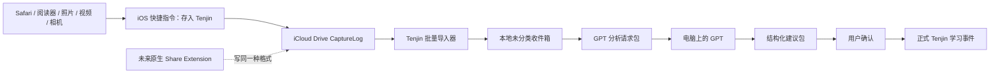

# Tenjin iOS 学习资料收件箱 PRD

**状态：** 待用户审阅

**日期：** 2026-07-12

**目标平台：** iPhone / iOS 18.4 及以上，仅限个人使用

**本轮交付：** 产品需求文档，不包含功能开发

## 1. 摘要

Tenjin 当前已经能可靠保存、撤销、搜索和复习文字记录，但“把现实学习场景中的资料送进 Tenjin”仍然过于费力。用户在阅读小说或文章、观看视频、玩 P5R、做题时，必须中断当前活动，切换应用，手工输入或粘贴文字，理解并选择“查过 / 没听出 / 表达纠正”，最后再保存。截图、照片、网页链接和题目材料还无法进入 Tenjin。

本 PRD 将产品原则改为：

> **先可靠收下，稍后再理解。捕获时不分类、不解释、不等待 AI。**

第一阶段采用 **iOS 分享菜单快捷指令 + iCloud Drive CaptureLog + Tenjin 未分类收件箱**：

1. 用户在任意支持系统分享的 iPhone 应用中分享文字、网页链接、截图或照片；
2. 点击“存入 Tenjin”；
3. 快捷指令将资料保存为一个完整、可校验的 Capture Package；
4. 保存成功后立即结束，不打开 Tenjin，也不要求填写表单；
5. 用户以后在 Tenjin 中批量导入、搜索、整理或导出给 GPT；
6. GPT 返回结构化建议包，Tenjin 校验后由用户确认是否写入正式学习账本。

快捷指令只是第一阶段的捕获适配器。未来若采用原生 iPhone App + Share Extension，原生扩展必须继续写入同一种 Capture Package，避免重做收件箱、GPT 往返和导入逻辑。

快捷指令内部约有 20 多个动作，但这些动作由开发者一次配置、测试并通过分享链接交付。用户不负责搭建内部流程；日常可见操作仍是打开分享菜单后点击一次“存入 Tenjin”。

## 2. 已确认的产品决策

| 事项 | 决策 |
|---|---|
| 平台 | 只考虑 iPhone / iOS，不投入 Android 兼容工作 |
| 最低系统 | iOS 18.4；旧版本不属于第一阶段支持范围 |
| 主要场景 | 同一部 iPhone 中可分享的内容略多于电视、主机和纸面内容 |
| 捕获行为 | 选择 Tenjin 后自动保存并结束，不展示分类或备注表单 |
| 捕获内容 | 文字、富文本、网页 URL、Safari 页面、截图、照片；普通视频文件不属于第一阶段 |
| 捕获分类 | 捕获时不要求选择 R / L / P，也不默认伪装成“查过” |
| 同步介质 | 用户自己的 iCloud Drive |
| 第一阶段同步范围 | iCloud 只同步原始 Capture Package 和 GPT 往返文件，不自动同步 Tenjin 的 IndexedDB、处理状态或正式账本 |
| 账本事实源 | 第一阶段以 iPhone 上的 Tenjin 为唯一正式账本；电脑只用于读取分析包和运行 GPT |
| 账本恢复 | 使用用户主动导出到 iCloud 的版本化 Vault Backup；这是批量恢复点，不是实时同步 |
| AI 边界 | 捕获路径不运行 OCR 或 GPT；分析发生在稍后的显式流程中 |
| GPT 往返 | 使用结构化导出包和结果包，不以手工复制大段文本作为正式流程 |
| 第一阶段入口 | 名为“存入 Tenjin”的 iOS 快捷指令 |
| 原生 App | 保留为未来升级路径；当前没有付费开发者账号，因此不作为第一阶段交付前提 |
| 签名态度 | 可以接受原生版本必需的签名步骤，但尚未承诺每 7 天重新安装；开发前必须先确认可持续分发方式 |
| 发布方式 | 个人使用，不要求 App Store 对外发布 |
| 今日范围 | 仅完成 PRD，不开始开发 |

## 3. 背景与问题

### 3.1 当前实际流程

当前 Tenjin 的常见文字记录流程是：

```text
在来源应用找到内容
→ 选择并复制，或努力记住
→ 切换到 Tenjin
→ 点击空白输入框
→ 调出系统粘贴菜单或手工输入
→ 判断“查过 / 没听出 / 表达纠正”
→ 必要时填写第二个纠正输入框
→ 点击“记下来”
```

这条路径常见需要 6–9 个用户动作，并且把“捕获”和“整理”绑定在同一时刻。它与原设计中“已复制文本 P50 不超过 5 秒、P90 不超过 8 秒”的目标不符。

### 3.2 场景障碍

| 场景 | 当前障碍 |
|---|---|
| 小说、文章 | 可以复制时仍需切应用和手工粘贴；整句与目标词没有结构化区分 |
| 网页 | 无法直接保存标题、URL、选中文字和页面截图 |
| 视频 | 无法保存视频链接、字幕截图或时间点；不可复制字幕只能手打 |
| P5R | 主机画面无法复制，只能凭记忆输入；无法附加截图或现场照片 |
| 纸面题目 | 无法拍照保存题干、选项、答案和解析 |
| 只是觉得值得记 | 三种 R / L / P 分类可能都不合适，但当前必须选一个 |

### 3.3 约束

- 用户只使用 iPhone，不需要 Android 兼容。
- 第一阶段最低支持 iOS 18.4，因为目录导入依赖该版本在 iPhone 上提供的 `webkitdirectory` 选择能力。
- 当前主要开发环境是 Windows；有一台公司 Mac 可在公司政策允许时用于 Xcode 和真机调试。
- 当前无法依赖付费 Apple Developer Program。
- 免费 Personal Team 的 iOS 安装签名 7 天到期，因此不能作为长期日用发布方式。
- PWA 不能作为 iOS 系统 Web Share Target，也不能后台监控 iCloud Drive 文件夹。
- PWA 只能在用户明确选择文件或目录后读取 iCloud Drive 内容。
- 来源应用交给系统分享菜单什么内容，Tenjin 就只能收到什么；不能保证获得登录页、付费内容或动态网页全文。

### 3.4 术语

- **PWA：** 当前通过 GitHub Pages 安装到主屏幕的 Tenjin 网页应用。
- **Capture Package：** 快捷指令保存到 iCloud Drive 的一次不可变原始捕获目录。
- **CaptureLog：** iCloud Drive 中追加式保存 Capture Package 的目录；它是原始档案，不是处理状态数据库。
- **InboxCapture：** Capture Package 导入 Tenjin 后形成的本地未分类资料。
- **R / L / P：** 阅读识别、听力识别、表达输出三个正式学习通道。
- **正式账本：** Tenjin 的事件事实源；只有用户确认的学习事件会影响搜索、状态和复习。
- **Proposal：** GPT 或人工整理产生、但尚未写入正式账本的建议。

### 3.5 方案比较

| 方案 | 日常体验 | 首次成本 | 长期约束 | 结论 |
|---|---|---|---|---|
| 只改现有 PWA | 无法成为 iOS 系统分享目标，仍要切回 Tenjin | 低 | 不能解决截图、照片和跨 App 捕获 | 不采用 |
| 快捷指令 + iCloud CaptureLog | 分享菜单内点一次，保存后返回来源 App | 一次安装、选目录和授权 | 需要手动批量导入；来源 App 的 Content Graph 需真机兼容测试 | 第一阶段采用 |
| 原生 App + Share Extension | 系统集成最好，可进一步自动同步 | Xcode、签名、真机安装 | 免费签名 7 天；长期使用需付费账号或获授权的公司团队 | 通过真实使用与签名门槛后升级 |

第一阶段选择快捷指令，不是因为它比原生 App 更强，而是它在没有可持续签名渠道时仍能交付，并且能先验证最关键的“是否真的会随手捕获”。Capture Package 是两种入口共享的稳定契约，因此验证工作不会因以后改原生而作废。

## 4. 产品目标

### 4.1 核心目标

1. 捕获时不要求用户理解 Tenjin 的学习模型。
2. 从系统分享菜单开始，到收到成功反馈为止，不出现额外表单。
3. 在 Tenjin 未打开、GPT 不可用或网络暂时不可用时，仍优先保存原始资料。
4. 原始文字、URL 和图片必须保持可追溯，后续 AI 处理不能覆盖原件。
5. Tenjin 可以批量、幂等地导入 Capture Package，并在内部形成未分类收件箱。
6. 同一个 Capture Package 重复选择导入时，不得生成重复记录；用户主动重复分享同一内容仍视为两次独立 encounter。
7. 用户可以在电脑上把一批资料交给 GPT，并将结构化结果导回 Tenjin。
8. AI 只能提出建议；正式学习事件必须经过用户确认。
9. 第一阶段不依赖 Xcode、代码签名、付费开发者账号或自建服务器。
10. iPhone 上的正式账本、收件箱处置、导入墓碑和 proposal 决策必须可以通过版本化 Vault Backup 恢复。

### 4.2 体验指标

以下指标从快捷指令已经安装、权限已经授予后开始计算。耗时从用户点击来源应用的“分享”开始，到“已收下”出现为止；选择文字、截图或拍照所需时间单独观察，不伪装成一步操作。5 秒 / 8 秒目标适用于不超过 100 KB 的文字或 URL，以及不超过 10 MB 的单张图片。首次权限弹窗和 iCloud 提供器首次唤醒单独记录，不计入稳定态指标。

| 指标 | 目标 |
|---|---:|
| 打开分享菜单后完成捕获的 P50 | 不超过 5 秒 |
| 打开分享菜单后完成捕获的 P90 | 不超过 8 秒 |
| 一次分享 2–10 张图片、合计不超过 50 MB | 目标 30 秒内完成，且零丢失 |
| 分享菜单内的 Tenjin 专属选择 | 仅点击一次“存入 Tenjin” |
| 捕获时要求填写的字段 | 0 |
| 连续文字 / URL / 图片捕获 | 各 50 次零丢失 |
| 同一目录重复导入 | 0 条重复记录 |
| 首次安装与授权 | 有明确指南，目标 5 分钟内完成 |
| 失败误报成功 | 0 次 |

### 4.3 非目标

第一阶段明确不做：

- Android 分享或 Android PWA 兼容；
- 在快捷指令中运行 OCR、GPT、网页爬取或内容摘要；
- 在捕获时选择查过、没听出、表达纠正、标签或复习计划；
- 自动下载完整视频或音频文件；
- 静默抓取登录页、付费页面或其他应用未分享的内容；
- CloudKit 实时数据库同步；
- Tenjin 的内部收件箱状态、GPT 决策和正式账本在 iPhone 与 Windows 之间自动同步；
- App Store 发布、TestFlight 或原生 Share Extension；
- 自动删除 iCloud Drive 中的原始 Capture Package；
- 在未得到用户确认时把 AI 结果写入正式学习状态。

## 5. 用户场景

### 5.1 同一部 iPhone 上的文字

用户在 Safari、阅读器、题目应用或其他支持分享的应用中选择文字，点击系统分享，再点击“存入 Tenjin”。快捷指令保存分享出来的文字、页面标题和 URL 中实际可取得的部分。用户继续原来的阅读或做题，不打开 Tenjin。

### 5.2 网页链接

用户分享当前网页。快捷指令至少保存 URL；若系统同时提供标题、文章摘录或选中文字，也一并保存。Tenjin 不承诺在捕获时重新下载网页全文。

### 5.3 视频

对于视频页面，用户分享视频链接；对于值得保留的字幕或画面，用户先截图，再从截图预览或照片应用分享给“存入 Tenjin”。第一阶段不下载视频文件，也不提取通用播放时间点。

### 5.4 P5R 和纸面材料

用户使用相机拍摄电视、主机画面或纸面题目，再从相机预览或照片应用分享给“存入 Tenjin”。快捷指令保存来源应用实际交给分享菜单的最高保真文件表示；不承诺获得相册底层原始比特、全部元数据或原始编码。OCR 和学习内容提取留到以后。

### 5.5 多张图片

用户可以一次分享一组截图。快捷指令把它们保存为同一个 capture 的多个 payload，使题干、选项和解析不会散成互不相关的记录。

## 6. 用户流程

### 6.1 一次性安装与授权

快捷指令由开发者配置并测试后，通过 iCloud 分享链接交付。用户不需要自己逐个建立内部动作。

一次性流程压缩为四个用户任务；快捷指令内部动作不出现在用户指南里：

1. 打开交付链接并添加“存入 Tenjin”；Import Question 只选择一次父目录，默认建议 `iCloud Drive/Shortcuts/Tenjin/CaptureLog`；
2. 第一次分享时允许访问该 iCloud Drive 目录，并按需允许完成通知；
3. 在分享菜单“编辑操作”中把“存入 Tenjin”移到靠前位置；
4. 按指南用一段文字、一个 URL 和一张截图完成一次安装自检。

快捷指令固定保存目录并关闭“每次询问保存位置”。初次授权后，日常捕获不得再次要求选择目录。

### 6.2 日常捕获

```text
选择文字、链接或图片
→ 系统分享
→ 存入 Tenjin
→ iCloud Drive 写入成功
→ 显示“已收下”
→ 自动返回来源应用
```

日常捕获中不打开 Tenjin、不显示分类、不要求确认标题，也不等待 OCR 或 AI。

只有在完整 Capture Package 已经写入后才能显示“已收下”。如果 iCloud 未登录、空间不足、权限被撤销或保存动作失败，快捷指令必须明确显示失败，且不能创建看似完整的 manifest。

### 6.3 Tenjin 批量导入

```text
打开 Tenjin
→ 进入“收件箱”
→ 点击“从 iCloud 导入”
→ 在文件选择器中选择 Shortcuts/Tenjin/CaptureLog 下的月份目录
→ Tenjin 扫描完整 capture
→ 校验、去重并复制到本地 IndexedDB
→ 显示新增 / 重复跳过 / 失败数量
```

iOS 18.4 及以上支持网页通过目录选择器上传整个目录。每次选择只得到当次只读的 `FileList` 和相对路径，不得到持久目录句柄；Tenjin 不能静默重开、监听、移动或删除该目录，因此每次导入必须由用户主动选择。iOS 18.3 及以下不属于第一阶段支持范围。

iCloud CaptureLog 是追加式原始档案。网页在导入后不自动删除或移动外部文件；Tenjin 依靠 `captureId` 与 `packageDigest` 保证重复选择同一目录时幂等，并拒绝同 ID 不同内容的覆盖。只有确认便携完整 Vault Backup 已包含并校验相关附件后，才可以把清理旧文件视为安全操作。

第一阶段只有 iPhone Tenjin 可以接受或拒绝 proposal、生成正式学习事件。Windows 电脑可以读取 iCloud 文件并运行 GPT，但不维护第二份正式 Tenjin 账本，避免两个 IndexedDB 产生不同状态。

### 6.4 内部未分类收件箱

导入后的资料首先成为 `InboxCapture`，而不是 R / L / P 学习事件。

收件箱必须支持：

- 按捕获时间倒序浏览；
- 显示文字摘录、URL、图片缩略图和来源类型；
- 搜索尚未整理的文字和 URL；
- 查看原始附件；
- 删除或忽略；
- 选择一批资料导出给 GPT；
- 稍后人工整理为查过、没听出或表达纠正；
- 接收 GPT 建议后逐项确认。

收件箱不显示催办红点、不要求每日清空，也不因未整理资料阻塞继续捕获。

### 6.5 GPT 文件往返

```text
Tenjin 中选择一批 InboxCapture
→ 导出 .tenjin-analysis-request.zip
→ 通过 iCloud Drive 在电脑取得文件
→ 用户把文件交给 GPT
→ GPT 返回 .tenjin-analysis-result.json
→ Tenjin 导入并校验
→ 展示建议
→ 用户接受、修改或拒绝
→ 只有接受项进入正式学习账本
```

第一阶段以“在电脑上把请求包手工交给 ChatGPT，再把结果文件存回 iCloud Drive”为目标流程，不依赖 API。模型输出属于尽力而为；JSON Schema 校验、来源引用校验和用户确认才是进入 Tenjin 的信任边界。

Tenjin PWA 不能静默写入 iCloud。导出请求时，它通过系统分享或文件下载让用户把文件保存到 `iCloud Drive/Shortcuts/Tenjin/AnalysisRequests`；导入结果时，用户从 `AnalysisResults` 或其他保存位置显式选择 JSON。这是一次处理一批资料的操作，不进入每条资料的实时捕获路径。

GPT 建议可以包含：

- 建议的目标词或表达；
- 原句和必要上下文；
- 中文或日文解释；
- 建议学习通道；
- 建议提示与揭示内容；
- 来源 capture 的引用；
- 对图片 OCR 结果的 `uncertaintyNotes` 和 `needsReview` 提示；不把模型自报数字当作经过校准的置信度。

GPT 结果不得直接修改历史事件，也不得在用户确认前改变复习队列。

每个请求包必须同时包含：

- `instructions.md`：告诉 GPT 任务边界、禁止事项和输出要求；
- `result-schema.json`：机器可验证的结果 JSON Schema；
- `request.json`：包含 `requestId`、`createdAt`、`requestDigest` 和请求 schema 版本；
- `captures.json`：批次、capture 引用和可读元数据；
- 原始文字、URL 和被选中的图片附件。

第一阶段每个分析批次最多包含 20 个 capture，请求包解压后总大小不超过 50 MB。超出时 Tenjin 要求拆分批次。第一阶段结果只接收不超过 5 MB 的 `.tenjin-analysis-result.json`，不接收结果 zip 或模型生成的附件。结果必须带有全局唯一的 `resultPackageId`、对应的 `requestId` 与 `requestDigest`；每条建议必须带唯一 `proposalId` 和非空 `sourceRefs`。

### 6.6 Vault Backup 与恢复

iCloud CaptureLog 只能恢复原始捕获，不能恢复正式学习事件、用户修改后的建议、接受 / 拒绝决定、删除墓碑或事件坐标。第一阶段因此必须提供批量、手动的 `.tenjin-vault-backup.zip`：

- 包含版本化 `vault.json`、完整正式事件、contexts、InboxCapture 元数据、ImportLedger / 墓碑、AnalysisRequest / Result / Proposal / 决策、设备序列与 HLC 高水位，以及恢复所需设置；
- 默认可通过 `captureId`、`packageDigest` 和月份分片清单引用仍在 CaptureLog 的原始 payload，避免每次重复打包大量图片；
- “便携完整备份”模式把所有引用附件也装入备份；只有成功生成并校验该模式后，界面才可提示用户清理 CaptureLog；
- 导出由用户通过系统分享或下载保存到 `iCloud Drive/Shortcuts/Tenjin/Backups`，PWA 不声称可以后台静默备份；
- 恢复时先在现有账本之外验证版本、归档内所有摘要和引用，再写入 staging 数据库；便携完整备份缺少任何附件时必须拒绝；标准备份只验证外部依赖清单本身，依赖的 CaptureLog 分片暂不可用时可在用户确认后恢复为 `external-payload-pending`，以后通过选择对应月份分片补齐，且不能显示为“完整恢复”；
- 只有所选恢复模式的验证规则全部通过后才切换 staging 数据库；失败不得破坏现有账本；
- 第一阶段只支持恢复到空账本，或在明确警告并二次确认后整体替换；不做两个账本的自动合并。

数据页显示最近一次成功备份的时间和范围，但不使用红点、连续天数或羞耻文案。恢复点是最近一次 Vault Backup；其后的原始 capture 可从 CaptureLog 重导，但其后的正式决定若未备份则无法恢复，界面必须如实说明。

## 7. 系统结构



核心边界：

- 快捷指令只负责可靠捕获；
- iCloud Drive 只负责保存和跨设备传递不可变的 Capture Package；
- Tenjin 导入器负责校验、去重和本地持久化；
- Inbox 负责“先收下、后整理”；
- GPT 只生成 proposal；
- 现有 core reducer 只处理用户已经确认的正式学习事件。

## 8. Capture Package 规范

### 8.1 目录结构

每次分享对应一个不可变目录。CaptureLog 按 UTC 月份分片，避免长期使用后每次枚举全部历史文件：

```text
iCloud Drive/Shortcuts/Tenjin/CaptureLog/<YYYY-MM>/<timestamp>_<capture-id>/
├── payload-1.txt
├── payload-2.url.txt
├── payload-3.jpg
└── capture.json
```

目录名使用 UTC 安全时间串与 UUID 组合，避免重名和覆盖询问：

```text
20260712T231501Z_550e8400-e29b-41d4-a716-446655440000
```

### 8.2 Manifest

`capture.json` 是来源设备上的提交标记，必须最后写入。它不能保证 iCloud 跨设备按写入顺序同步，因此导入端仍必须等待并校验所有附件。第一版结构：

```json
{
  "schemaVersion": 1,
  "captureId": "550e8400-e29b-41d4-a716-446655440000",
  "capturedAt": "2026-07-12T23:15:01.000Z",
  "transport": "ios-shortcut",
  "payloads": [
    {
      "payloadId": "payload-1",
      "kind": "text",
      "role": "selection",
      "path": "payload-1.txt",
      "mediaType": "text/plain",
      "byteLength": 42,
      "sha256": "<64-character lowercase hex>"
    },
    {
      "payloadId": "payload-2",
      "kind": "url",
      "role": "page-url",
      "path": "payload-2.url.txt",
      "mediaType": "text/uri-list",
      "byteLength": 31,
      "sha256": "<64-character lowercase hex>"
    },
    {
      "payloadId": "payload-3",
      "kind": "image",
      "role": "attachment",
      "path": "payload-3.jpg",
      "mediaType": "image/jpeg",
      "originalName": "IMG_1234.JPG",
      "byteLength": 184320,
      "sha256": "<64-character lowercase hex>"
    }
  ]
}
```

约束：

- `schemaVersion`、`captureId`、`capturedAt`、`transport` 和至少一个 payload 必须存在；
- `captureId` 必须是 UUID；
- `capturedAt` 必须是 UTC ISO 8601 时间；不得把没有时区的本地时间直接追加 `Z`；
- 每个 payload 必须带唯一的 `payloadId`、`kind`、`role`、`path`、`mediaType`、`byteLength` 和 `sha256`；
- payload 的 `path` 必须互不重复；manifest 数组顺序必须保留规范化后的分享输入顺序；
- `role` 第一版允许 `selection`、`page-title`、`page-url`、`attachment` 和 `unknown`；
- `originalName` 是可选字段，只用于显示来源文件名；
- JSON 与文本文件统一为 UTF-8、无 BOM；manifest 中的相对路径统一使用 `/`；
- `path` 只能引用当前 capture 目录中的相对文件；空路径段、`.`、`..`、反斜杠、NUL 和绝对路径一律拒绝；
- 导入器拒绝路径穿越和未知 schema；未出现或不可读的引用文件按下述等待 / 停滞规则处理；
- `byteLength` 是最终保存文件的字节数，不是字符数；`sha256` 针对同一份最终字节计算；
- 快捷指令在写入 manifest 前计算字节数和 SHA-256；导入器对实际读取字节重新计算并核对；
- 目录没有 `capture.json` 时视为未完成写入，导入器忽略并报告；
- `capture.json` 存在但引用文件未出现在当次 `FileList`、无法读取或仍是文件提供器占位时，视为“等待同步”，不立即判为损坏；manifest 最后写入只减少半成品，不作为跨设备原子性保证；
- ImportLedger 记录首次发现时间与重试次数；相同缺失状态在至少 24 小时内经过 3 次用户主动重选后升级为“同步停滞”，但仍允许重试，只有用户显式“标记放弃”才成为本机终态；
- manifest 无效，或所有引用文件均可读后仍出现长度 / 哈希不匹配时，才视为损坏包；任何状态都不生成部分记录。

这些摘要用于发现截断、错配、重复和意外修改，不是数字签名，也不能证明文件没有被能修改同一 iCloud Drive 的人恶意重写。

导入器为每个完整包计算 `packageDigest`。第一版算法固定为：

1. 初始化字节流为 ASCII `TENJIN-CAPTURE-PACKAGE-V1\n`；
2. 追加 8 字节无符号大端整数，值为 `capture.json` 原始字节长度，再追加该文件原始字节；
3. 按 manifest 数组顺序，对每个 payload 依次追加：4 字节无符号大端路径长度、UTF-8 路径字节、8 字节无符号大端 `byteLength`、把 64 位小写十六进制 `sha256` 解码得到的 32 个原始字节；
4. 对完整字节流计算 SHA-256，以 64 位小写十六进制保存为 `packageDigest`。

协议实现前必须提交至少三个跨实现 golden vector：单文本、多图片和同 ID 内容冲突。导入判定如下：

- 本地没有该 `captureId`：正常导入并记录 `packageDigest`；
- `captureId` 与 `packageDigest` 均相同：视为同一包的重复扫描，跳过；
- `captureId` 相同但 `packageDigest` 不同：视为 ID 冲突或包被修改，拒绝覆盖并提示用户。

### 8.3 分享输入规范化

快捷指令必须先把 iOS 分享输入规范化成明确的 payload 列表，再开始提交 Capture Package：

1. 在任何循环之外只生成一次 `captureId` 和 `capturedAt`；
2. 对分享菜单交来的顶层项目执行一次 `Repeat with Each`；
3. 每个项目只进入一个按实际输入类型选择的主分支，不能把同一个对象经 Content Graph 同时派生为重复的文字、URL 和文件；
4. Safari Web Page 是允许的复合类型：保存系统实际可提供的 URL，并可附带标题和选中文字；
5. URL 只保存 URL；Text / Rich Text 只生成一份 UTF-8 纯文本；Image 保存来源应用实际交付的文件表示；
6. 如果顶层项目中存在 Safari Web Page，则它是页面 URL、标题和选中文字的权威容器；额外顶层 URL 与其页面 URL 完全相同，或额外 Text / Rich Text 与其派生标题 / 选中文字 UTF-8 字节完全相同时，跳过该重复表示；非相同项目继续保留；
7. 用户真实选择的多张图片全部保留为同一 capture 的不同 payload，不因内容相同而自动合并；
8. 写入前检查可得的项目数量和大小，写入后针对实际落盘字节再次核对编码后的总大小、`byteLength` 与 SHA-256；超限、转换或哈希失败时不写 manifest、不显示成功，并尽力清理半成品。

### 8.4 支持的内容

第一阶段必须支持：

- UTF-8 纯文本；
- 富文本转成的可读纯文本；
- HTTP / HTTPS URL；
- 来源应用实际交付的 JPEG、PNG、HEIC 截图或照片；
- 一次分享中的多项输入；
- 正常规模的多张图片。

第一阶段硬限制：

- `capture.json` 不超过 256 KB，单包 payload 不超过 20 项；
- 单个 Text / Rich Text payload 不超过 1 MB；
- 单个 URL payload 不超过 16 KB，去除首尾空白后必须是一个绝对 HTTP / HTTPS URL；
- 单张图片不超过 10 MB，一次最多 10 张；
- 单个 Capture Package 所有 payload 合计不超过 50 MB；
- 图片不能只凭扩展名放行；导入器必须核对允许的媒体类型与可识别文件签名。

第一阶段不支持：

- PDF、Office 文档、压缩包和其他通用文件；
- 整个视频和音频文件；
- 可执行文件；
- 未经明确允许的任意大文件；
- 快捷指令自行访问来源应用未分享的数据。

第一阶段验收上限为单张图片 10 MB、一次 2–10 张且合计 50 MB；真机测试可向下收紧但不能静默丢弃。超过上限时快捷指令提示拆分分享，不写 manifest，也不显示成功。若 Windows 浏览器不能解码 HEIC 缩略图，Tenjin 必须保留原文件并显示可下载的占位项；可选 JPEG 预览只能作为单独派生附件，不能替换原文件。

## 9. 功能需求

### 9.1 捕获快捷指令

| ID | 优先级 | 需求 |
|---|---|---|
| CAP-01 | Must | 快捷指令名为“存入 Tenjin”，并可从 iOS 系统分享菜单运行 |
| CAP-02 | Must | 接收 Text、Rich Text、URL、Safari Web Page 和 Image 输入；拒绝其他文件类型 |
| CAP-03 | Must | 正常捕获不显示表单、不要求分类或备注 |
| CAP-04 | Must | 按第 8.3 节规范化 Content Graph；同一顶层对象只进入一个主类型分支，Safari 复合页面除外 |
| CAP-05 | Must | 每次调用在循环外生成一个全局唯一的 `captureId`，多项输入共享该 ID |
| CAP-06 | Must | 为每次捕获创建独立目录，先写 payload，最后写 `capture.json` |
| CAP-07 | Must | 只有所有必需写入和核对成功后才显示“已收下” |
| CAP-08 | Must | 通过 Import Question 一次选择父目录，默认建议 `iCloud Drive/Shortcuts/Tenjin/CaptureLog`，并关闭日常“每次询问保存位置” |
| CAP-09 | Must | 空输入、权限失败、iCloud 不可用、空间不足、转换失败或哈希失败时停止，不误报成功 |
| CAP-10 | Must | 支持一次分享多张图片，并保持它们属于同一个 capture |
| CAP-11 | Must | 对每个 payload 记录 role、MIME、字节数和 SHA-256，以检测 iCloud 截断或错配 |
| CAP-12 | Must | 在提交前执行数量与大小限制；任何超限都不写 manifest、不静默丢弃 |
| CAP-13 | Should | 通过 iCloud 分享链接交付，用户不需要手工搭建内部动作 |
| CAP-14 | Should | 提供一页首次安装、授权和置顶指南 |
| CAP-15 | Could | 提供独立的诊断版快捷指令，用于查看来源应用实际分享的 Content Graph |

### 9.2 Tenjin 导入器

| ID | 优先级 | 需求 |
|---|---|---|
| IMP-01 | Must | 提供“从 iCloud 导入”入口，允许用户选择 CaptureLog 根目录或单个 `YYYY-MM` 分片目录 |
| IMP-02 | Must | 递归发现并校验完整 Capture Package |
| IMP-03 | Must | 按 `captureId` + `packageDigest` 判定新包、相同重复包和同 ID 内容冲突；冲突不得覆盖 |
| IMP-04 | Must | 在 IndexedDB 事务之外读取文件、检查路径 / 大小并计算哈希；验证完成后用短事务原子写入元数据、附件和 ImportLedger |
| IMP-05 | Must | 报告新增、重复跳过、未完成、等待同步、同步停滞、已放弃和损坏包数量 |
| IMP-06 | Must | 未出现 / 不可读的引用文件按等待规则处理；拒绝未知 schema、非法路径、可读但长度或哈希错误、以及超出限制的内容 |
| IMP-07 | Must | 导入后无需修改或删除 iCloud 原始 Capture Package |
| IMP-08 | Must | 永久保留 captureId、packageDigest、导入账目和删除墓碑，使本地删除的 capture 不因再次扫描 iCloud 而复活 |
| IMP-09 | Should | 计算规范内容哈希，为后续相似内容提示提供基础；内容相似不自动合并 encounter |
| IMP-10 | Should | 日常引导选择单月分片；恢复扫描根目录时一次最多处理 2,000 个包，超出后要求按月份拆分 |
| IMP-11 | Should | 导入前在浏览器能力允许时估算本地剩余空间并申请持久存储；容量不足仍必须由事务错误安全回退，不能把估算当保证 |

### 9.3 内部收件箱

| ID | 优先级 | 需求 |
|---|---|---|
| INB-01 | Must | 支持不带 R / L / P 分类的 `InboxCapture` |
| INB-02 | Must | 展示文字、URL、图片缩略图和捕获时间 |
| INB-03 | Must | 未整理 capture 仍可搜索和查看 |
| INB-04 | Must | 删除、忽略和整理必须是显式操作 |
| INB-05 | Must | 将 raw capture 转成正式学习项前必须由用户确认 |
| INB-06 | Should | 支持一次选择多条资料导出给 GPT |
| INB-07 | Should | 不用红点、连续天数或欠账文案催促清空收件箱 |

### 9.4 GPT 往返

| ID | 优先级 | 需求 |
|---|---|---|
| GPT-01 | Must | 导出请求包时保留 `captureId`、原始内容、payload 引用和附件 |
| GPT-02 | Must | 请求包和结果包均使用版本化 JSON schema |
| GPT-03 | Must | 请求、结果和每条建议分别带有 `requestId`、`resultPackageId` 和 `proposalId`；结果必须回显 `requestDigest` |
| GPT-04 | Must | 每条建议带有非空 `sourceRefs`，引用有效的 `captureId` 和可选 `payloadId`；一条 capture 可对应多条建议 |
| GPT-05 | Must | 导入结果前验证 schema、引用、字段长度和附件声明 |
| GPT-06 | Must | 以 `resultPackageId`、`proposalId` 和规范内容摘要保证幂等；同 ID 不同内容必须报冲突而非覆盖 |
| GPT-07 | Must | 无效或未知字段不能改变正式账本 |
| GPT-08 | Must | 用户可以逐项接受、修改或拒绝建议，并保留原建议、修改后内容和决定时间 |
| GPT-09 | Must | 只有接受项生成正式 Tenjin 事件 |
| GPT-10 | Should | 支持 GPT 对图片给出 OCR 文本、`uncertaintyNotes` 和 `needsReview`，同时保留收到的来源图片文件；不要求伪精确数字置信度 |
| GPT-11 | Could | 未来允许在 Tenjin 内直接调用 AI，但不得改变捕获协议 |
| GPT-12 | Must | iPhone 主屏模式可通过系统分享 / 下载把请求包保存到 iCloud，并通过文件选择器导入结果 JSON；失败不得改变 proposal 或正式账本 |

### 9.5 Vault Backup 与恢复

| ID | 优先级 | 需求 |
|---|---|---|
| BKP-01 | Must | 导出版本化 `.tenjin-vault-backup.zip`，为每个逻辑文件记录路径、字节数和 SHA-256，并为整个备份计算摘要 |
| BKP-02 | Must | 备份所有正式事件、contexts、InboxCapture、ImportLedger / 墓碑、分析实体 / 决策、设备序列与 HLC 高水位和必要设置 |
| BKP-03 | Must | 标准备份列出带 captureId、packageDigest 和月份分片的外部依赖；缺失依赖经用户确认后恢复为 `external-payload-pending`，不得称为完整恢复；便携完整备份必须包含并校验所有附件，否则整次恢复拒绝 |
| BKP-04 | Must | 恢复前拒绝未知 schema、非法路径、重复 ID、摘要不符、超过 10,000 个文件或解压后超过 250 MB 的归档 |
| BKP-05 | Must | 在 staging 数据库中完成验证与写入，成功后才整体切换；任何失败都保留原账本 |
| BKP-06 | Must | 第一阶段只恢复到空账本或经二次确认后整体替换，不自动合并两个账本 |
| BKP-07 | Must | 数据页显示最近成功备份时间、是否包含全部附件、外部分片依赖和“备份后决定可能丢失”的恢复点说明 |
| BKP-08 | Must | iPhone 主屏模式可通过系统分享 / 下载把备份保存到 iCloud，并可从文件选择器完成恢复 |
| BKP-09 | Should | 标准状态备份目标不超过 25 MB；便携完整备份首版上限 250 MB，超限时保留 CaptureLog 并明确提示，不误报成功 |
| BKP-10 | Must | `external-payload-pending` 只影响附件可用性，不回滚已校验的正式事件和处置状态；补齐分片时必须再次核对 captureId、packageDigest、字节数与哈希 |

## 10. 数据模型边界

### 10.1 新的 InboxCapture

第一阶段需要一个与正式学习状态分离的原始资料模型：

```text
InboxCapture
- captureId
- packageDigest
- capturedAt
- importedAt
- transport
- textPayloads[]
- urlPayloads[]
- attachments[]
- disposition: active | ignored | deleted
- sourcePackageVersion
```

`InboxCapture` 不自动创建 `item_created`，也不自动生成 `lookup_observed`、`listening_miss_observed` 或 `production_correction_observed`。

导入器另行维护 `ImportLedger`。它至少记录 `captureId`、`packageDigest`、首次导入时间、最近扫描结果和删除墓碑。即使本地附件已经删除，墓碑仍保留，避免 iCloud 原包在下次扫描时复活。

### 10.2 AnalysisProposal

GPT 状态不得压缩进 `InboxCapture.disposition`。一条 capture 可以被多次分析，也可以产生多条建议，因此单独建模：

```text
AnalysisRequest
- requestId
- createdAt
- captureRefs[]
- schemaVersion
- requestDigest

AnalysisResultPackage
- resultPackageId
- requestId
- requestDigest
- resultDigest
- importedAt
- schemaVersion

AnalysisProposal
- proposalId
- resultPackageId
- sourceRefs[]
- proposalDigest
- originalSuggestion
- editedSuggestion?
- decision: pending | accepted | rejected
- decidedAt?
- resultingEventIds[]
```

`requestDigest` 由 Tenjin 在导出时对规范化请求元数据及附件摘要计算，结果包只能原样回显；它用于拒绝“结果引用了另一个同 ID 请求”的错配。`resultDigest` 与 `proposalDigest` 由导入器计算。重复导入同 ID、同摘要的结果包时不得生成新 proposal 或新学习事件；同 ID、不同摘要必须报冲突。

### 10.3 Promotion

当用户人工整理或接受 GPT 建议时，系统才把 `InboxCapture` 晋升为正式学习项。实现阶段需要补齐当前 core 尚未实现的 promotion 事件或等价的显式引用机制，保证：

- 每个正式 item 都能追溯到来源 capture；
- 同一 capture 的重复建议不会双重计入学习证据；
- 拒绝或忽略建议不会删除原始 capture；
- GPT 结果不是事实源，用户确认事件才是事实源。

## 11. 错误处理

| 故障 | 期望行为 |
|---|---|
| 快捷指令没有收到输入 | 停止并显示“没有可保存的内容” |
| iCloud 未登录 | 显示明确失败，不创建 `capture.json` |
| iCloud 空间不足 | 显示明确失败，不显示“已收下” |
| 保存某个附件中断 | 允许显示快捷指令系统错误；可以保留半成品目录，但不写 manifest、不显示“已收下”，导入器忽略 |
| 来源应用只分享 URL | 保存实际收到的 URL，不假装已经取得全文 |
| 同一目录重复导入 | `captureId` 与 `packageDigest` 都相同时跳过，不重复创建 |
| 同一 `captureId` 对应不同 `packageDigest` | 标记 ID 冲突并拒绝覆盖，保留既有记录 |
| manifest 已到达但附件尚未下载 | 标记“等待 iCloud 同步”，稍后重试，不立即报损坏 |
| 同一附件缺失状态跨 24 小时主动重试 3 次 | 标记“同步停滞”，允许继续重试或由用户显式标记放弃，不自动判损坏 |
| `capture.json` 无效或哈希不匹配 | 报告损坏包，不导入任何部分记录 |
| 本地 InboxCapture 已删除但 iCloud 原包仍在 | 依据 ImportLedger 墓碑跳过，不复活 |
| GPT 返回无效 JSON | 拒绝整个结果包，不改变账本 |
| GPT 引用未知 capture | 拒绝相关建议并展示原因 |
| IndexedDB 写入失败 | 保留 iCloud 原始包，允许以后重试 |

## 12. 隐私与安全

- 捕获阶段不把资料发送到 Tenjin 服务器、GitHub 或 AI 服务。
- Capture Package 保存在用户自己的 iCloud Drive 中。
- 用户显式导出给 GPT 时，才跨越本机 / iCloud 的隐私边界。
- 导出界面必须说明将要包含文字、URL 和哪些图片。
- 不把 API Key 写入快捷指令或 Capture Package。
- 导入器把所有外部文件视为不可信输入，限制大小、路径和 schema。
- 图片 OCR 或 GPT 分析不能替换、修改或删除收到的来源图片文件。
- CaptureLog 作为原始档案默认只追加，不自动清理。
- 第一阶段不声称同步 Tenjin 内部状态；电脑只处理请求包和结果包，正式决定回到 iPhone Tenjin 完成。

## 13. 交付阶段

### 阶段 0：PRD

- 完成本 PRD；
- 不修改产品代码；
- 用户审阅并确认范围后再写实施计划。

### 阶段 1：Capture Package 与快捷指令原型

- 固化 `capture.json` schema；
- 在真实 iPhone 上建立稳健版“存入 Tenjin”；
- 验证文字、URL、Safari 页面、单图和多图；
- 验证固定目录、一次性权限、失败提示和离线行为；
- 验证 Import Question 在首次添加、新设备重新添加、重启和离线后仍不会变成日常保存询问；
- 生成可安装的 iCloud 快捷指令链接和设置指南。

### 阶段 2：Tenjin 导入器与未分类收件箱

- 增加 iCloud 目录导入；
- 增加 Capture Package 校验和幂等去重；
- 增加图片附件本地存储；
- 增加 InboxCapture 视图、搜索和删除 / 忽略；
- 增加 Vault Backup 导出、完整性校验、空库恢复和整体替换恢复；
- 保留现有记录、复习和搜索能力。

### 阶段 3：GPT 请求包与建议包

- 增加批量导出；
- 固化 GPT 输入与输出 schema；
- 增加结果导入、预览、修改、接受和拒绝；
- 补齐正式 promotion 事件与引用。

### 阶段 4：原生 App 决策门

完成 14 天真实使用后，只有同时满足“体验需要”与“签名可行”两个条件时，才进入原生 App 方案。

体验需要至少满足一项：

- 快捷指令捕获的 P90 持续超过 8 秒；
- 分享菜单快捷指令频繁丢失输入或权限不稳定；
- 每周至少三次因为快捷指令摩擦而放弃记录；
- CloudKit 自动同步和原生 Share Extension 的收益明确高于签名维护成本。

签名可行必须先满足：选定的开发团队能够把“主 App + Share Extension + App Group”最小原型签名并安装到真实 iPhone，主 App 与扩展可以通过 App Group 完成一次读写；如果目标版本还依赖 iCloud / CloudKit，也必须在同一团队下验证对应 entitlement 和真机往返。只要任一目标 capability 不可用，该团队就不算可行。

完成 capability 验证后，还必须满足一种可持续分发方式：

- Personal Team 确实包含目标架构需要的全部 entitlement，且用户明确接受每 7 天重新签名和安装；
- 用户取得个人 Apple Developer Program；
- 公司明确授权使用其开发者团队、App ID 和相关 iCloud 容器。

若进入原生方案，优先采用 React + Capacitor 主应用、Swift Share Extension、App Group 原生存储；原生入口必须继续遵守本 PRD 的 Capture Package schema。若为性能而绕过 iCloud 文件落地，也必须使用同一 schema 生成可导出包，不能以“等价”名义另造不兼容协议。

## 14. 验收测试

### 14.1 快捷指令

- 从 Safari 分享选中文字 50 次，全部生成完整 capture；
- 从 Safari 分享网页 URL 50 次，全部保存实际收到的 URL；
- 分享 Safari 页面时，同一 Content Graph 转换不产生重复的派生文字或 URL；
- fixture 同时含 Safari Web Page、相同顶层 URL、相同顶层 Text 和一段不同 Text 时，只跳过与 Safari 派生值字节完全相同的表示，不丢失不同 Text；
- 从照片应用分享单张截图 50 次，全部可打开；
- 一次分享 2–10 张图片各 3 轮，分组不丢失；
- 连续快速分享 10 次，UUID 不重复；
- 第一次授权后，后续捕获不再询问保存目录；
- 关闭网络后捕获，再联网检查 iCloud 同步结果；
- 撤销 iCloud 权限或制造空间不足场景时，不误报成功；
- 分享不支持的内容时给出明确提示。
- 在权限已授予、iCloud 已热启动的真机上分别记录 50 次标准文字、URL 和单图捕获，按屏幕录像时间戳计算 P50 / P90；首次权限和冷启动另列，不混入稳定态指标。

### 14.2 导入器

- 选择包含 50 个 capture 的目录，全部正确导入；
- 选择包含 2,000 个小型 capture 的恢复目录完成边界性能测试；超过上限时要求选择月份分片；
- 再次选择同一目录，新增数量为 0；
- 复制一个 capture 后篡改内容但保留原 `captureId`，导入器报告摘要冲突且不覆盖；
- 单文本、多图片和冲突三个 golden vector 在快捷指令产物、浏览器导入器和独立参考实现中得到完全相同的 `packageDigest`；
- 缺少 manifest 的半成品目录被忽略并报告；
- manifest 非法、可读附件长度 / 哈希不符、路径穿越和超大文件被拒绝；
- manifest 先同步而附件暂未下载时显示“等待同步”，稍后可成功重试；
- 用可控时钟验证同一缺失状态跨 24 小时主动扫描 3 次后进入“同步停滞”，仍可继续重试或显式标记放弃；
- 任何单包失败不影响其他合法包；
- 验证大附件读取和 SHA-256 计算发生在 IndexedDB 事务外，最终短事务失败后可从 iCloud 原包重试；
- iPhone iOS 18.4 主屏模式可以导入月份目录；Windows 端无需运行第二份 Tenjin 即可取得并解压分析请求包。

### 14.3 GPT 往返

- 导出包可在电脑端解压并识别每个 capture；
- 在 iPhone 主屏模式把请求包保存到 iCloud、电脑交给 ChatGPT、将结果 JSON 存回 iCloud、iPhone 选择导入，完成一次真实端到端往返；
- 有效结果包能映射回原始 capture；
- 一条 capture 的多条 proposal 可以分别接受和拒绝；
- 重复导入同一建议包不会重复创建学习证据；
- 相同 `resultPackageId` 或 `proposalId` 携带不同内容时报告冲突，不覆盖既有建议；
- `requestId` 存在但 `requestDigest` 不匹配的结果包被拒绝；
- 无效 schema、未知引用和超长字段被拒绝；
- 接受、修改和拒绝均留下明确结果；
- 未确认建议不出现在正式复习队列中。

### 14.4 Vault Backup 与恢复

- 在 iPhone 主屏模式导出标准备份，通过系统分享 / 下载保存到 iCloud，再从空账本恢复；正式事件、contexts、墓碑、proposal 决策和 HLC 高水位完全一致；
- 导出便携完整备份后，在没有 CaptureLog 的空环境恢复，所有测试附件均可打开；
- 标准备份缺少声明的 CaptureLog 分片时，经用户确认后恢复元数据并将相关附件标为 `external-payload-pending`，不伪装成完整恢复；之后选择正确月份分片可补齐；
- 便携完整备份删除任一附件后，整次恢复被拒绝，原账本不变；
- 破坏任一逻辑文件、制造路径穿越、重复 ID、超大归档或未知 schema 时，恢复被拒绝且原账本不变；
- 恢复过程中模拟容量不足或事务失败，staging 数据被清理，原账本仍可正常打开；
- 备份并恢复后继续创建事件，设备序列和 HLC 不与历史坐标冲突。

## 15. 风险与缓解

| 风险 | 缓解方式 |
|---|---|
| 用户曾因快捷指令复杂而弃用旧工具 | 用户只安装已配置好的共享快捷指令，不自行搭建 20 多个内部动作；提供 5 分钟设置指南 |
| 分享菜单入口位置太深 | 指南包含将“存入 Tenjin”放到靠前位置的步骤，并用真实 iPhone 验证点击数 |
| 不同应用分享的内容类型不一致 | 使用诊断快捷指令收集 Content Graph；按真实来源应用建立兼容测试矩阵 |
| 快捷指令写入中途终止 | payload 先写、manifest 最后写；导入器只接受有合法 manifest 的目录 |
| iCloud 同步延迟或同步顺序变化 | manifest-last 不被当作跨设备原子保证；成功标准是来源设备本地写入成功，导入端把附件暂缺视为“等待同步”，核对字节数、SHA-256 和 packageDigest 后才接收 |
| PWA 不能后台监控 iCloud | 把导入明确设计为用户主动发起的批量动作，不伪装成自动同步 |
| CaptureLog 长期增长导致目录选择和扫描变慢 | 按 UTC 月份分片；日常只选择单月目录，根目录恢复扫描设置 2,000 包上限 |
| PWA 本地存储可能被系统回收 | iCloud CaptureLog 保留原始包作为可重导入档案；数据页继续显示持久化状态 |
| PWA 被清理后正式事件、决定和墓碑无法从 CaptureLog 恢复 | Vault Backup 是上线前 Must；数据页显示恢复点，便携完整备份通过真机破坏性恢复演练 |
| 图片快速占用空间或 HEIC 无法预览 | 导入时显示附件大小并执行 10 MB / 50 MB 上限；保留来源文件，无法解码时显示占位项，不自动下载视频 |
| GPT 输出看似合理但错误 | 结果只进入 proposal，必须引用 capture 并由用户确认 |
| 以后改成原生 App 造成返工 | 快捷指令、原生 Share Extension 和 Tenjin 导入器共享同一版本化捕获协议 |

## 16. PRD 完成定义

本 PRD 经用户确认后，下一步只编写实施计划，不直接开始开发。实施计划必须把以下内容拆成独立、可测试的阶段：

1. Capture Package schema；
2. 快捷指令真机原型；
3. Tenjin 导入器；
4. 未分类收件箱；
5. GPT 请求 / 结果协议；
6. 原生 App 决策门。

任何实现不得把 OCR、GPT 或分类重新放回实时捕获路径。

## 17. 官方依据

- [Apple：从其他 App 的分享菜单运行快捷指令](https://support.apple.com/en-euro/guide/shortcuts/apd163eb9f95/ios)
- [Apple：快捷指令支持的输入类型](https://support.apple.com/en-ie/guide/shortcuts/apd7644168e1/ios)
- [Apple：快捷指令中的文件保存动作](https://support.apple.com/en-ca/guide/shortcuts/apdaf74d75a5/ios)
- [Apple：快捷指令中的 JSON 与 Dictionary](https://support.apple.com/en-asia/guide/shortcuts/apd0f2e057df/ios)
- [Apple：为共享快捷指令设置 Import Questions](https://support.apple.com/guide/shortcuts/add-import-questions-to-shared-shortcuts-apdf330fd3a0/ios)
- [WebKit：Safari 18.4 在 iOS 支持 `webkitdirectory` 目录选择](https://webkit.org/blog/16574/webkit-features-in-safari-18-4/)
- [Apple：免费 Personal Team 的 7 天签名限制](https://developer.apple.com/help/account/basics/about-your-developer-account/)
- [Apple：iOS provisioning profile 的 capability 取决于会员类型](https://developer.apple.com/help/account/reference/supported-capabilities-ios/)
- [Apple：Apple Developer Program 注册与费用](https://developer.apple.com/help/account/membership/program-enrollment/)
- [Apple：Share Extension](https://developer.apple.com/library/archive/documentation/General/Conceptual/ExtensibilityPG/Share.html)
- [Apple：CloudKit 私有数据库](https://developer.apple.com/documentation/cloudkit/ckcontainer/privateclouddatabase)
